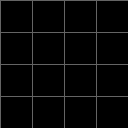
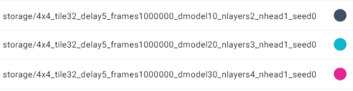
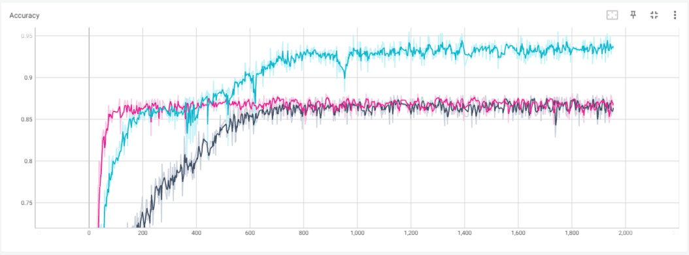
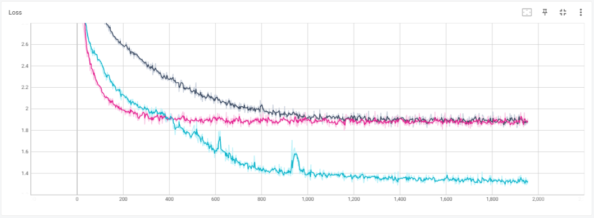
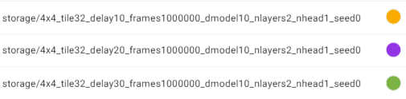
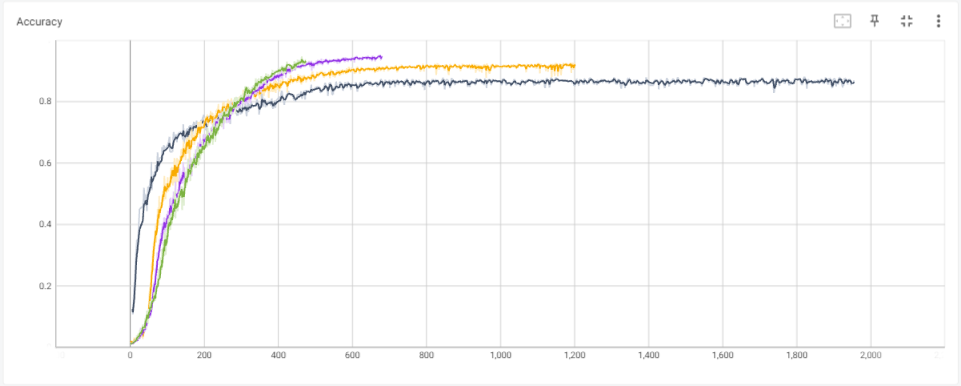
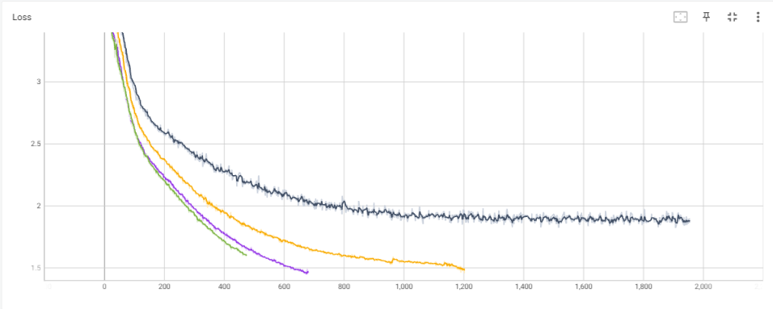

# [WIP] Delayed Match-to-Sample

> Write the code for training a causal transformer network (with depth of two and dimension of 10) to learn the delayed match-to-sample task with cross-entropy loss. You can use mini-grid environment (https://github.com/maximecb/gym-minigrid) to
instantiate this task. Each episode starts by a view of the empty grid. Then a random image of a shape (square, triangle, circle) is shown in one of the squares (cue). The color and size are randomized. After a random number of delay frames (maximum 5 frames),
images of two shapes are shown in two random grid-locations (tests). The shape in one of the “test” images matches that in the “cue” image. The correct action is to select the grid-location containing the matching test image.

To accomplish this task, I first implement a minigrid environment named [`DMTSGridEnv`](wm-causal-transformer/working_memory_env/envs/grid_world.py). The satisfying the requirements above, with the number of frames for each episode being `max_delay_frames + 3`, i.e., the first frame is the empty grid, the second frame is the cue, and the final frame is the test frame.

Then, I design a model that predict both the current `state` of the sequence: is it time to actuate and match-to-sample, and the action to be taken. The model, called [`VisualCausalTransformer`](visual_causal_transformer.py), is composed of a convolutional encoder, a decoder-only transformer, and linear decoder layers. At each timestep, the model take in a new RGB `frame` from the environment, a `memory` consists of convolutional embeddings from previous frames, the sequence of `states` so far, and the sequence of `goals`, or actions, expected by the environments so far. 

The predicted `states` is used to mask the action logits of the model, making explicit relationship between correctly predicting the state and the performance. The training loss is the sum of the multi-dimensional `CrossEntropyLoss` over the sequence of states and the multi-dimensional `CrossEntropyLoss` over the sequence of actions.

The driver and agent codes are adapted from `torch-ac`. `ParallelEnv` is modified so that each environment process is not restarted continuously by repeat the final states instead to facilitate batch training.

## Usage
First, install a conda environment with `python=3.8` and  `pytorch=1.12.1` with appropriate `torchvision` and `cudatoolkit` versions.

Then, install requirements with `pip install -r requirements.txt`


To train a model, use
```
python -m scripts.train \
--save-interval 10 \
--grid-size 4 \
--tile-size 32 \
--max-delay-frames 10 \
--procs 64 \
--frames 1000000 \
--d_model 10 \
--nlayers 2 \
--nhead 1 \
--device cuda:0 \
--seed 0
```

in which,
  - `--save-interval`: number of updates between two saves (default: 10, 0 means no saving)
  - `--procs`: number of processes (training batch size) (default: 16)
  - `--frames`: number of frames of training (default: 1e7)
  - `--tile-size`: size of each cell in term of pixels
  - `--grid-size`: square grid size
  - `--d_model`: transformer embedding size
  - `--nlayers`: number of transformer blocks
  -`--nhead`: transformer attention heads
  - `--max-delay-frames`: maximum number of delay frames per episode
  - `--lr`: learning rate (default: 0.001)
  - `--device`: cuda or cpu device
  - `--seed`: random seed (default: 1)

  The training results can be observered by pointing Tensorboard to folder `storage`.

To visualize, use
```
python -m scripts.visualize \
--grid-size 4 \
--tile-size 32 \
--model 4x4_tile32_delay30_frames1000000_dmodel10_nlayers2_nhead1_seed0 \
--max-delay-frames 30 \
--d_model 10 \
--nlayers 2 \
--nhead 1 \
--episode 100 \
--seed 99 \
--gif \
--pause 0.8
```

in which, 
- `--grid-size`: square grid size
- `--tile-size`: size of each cell in term of pixels
- `--model`: name of the trained model (REQUIRED)
- `--max-delay-frames`: maximum number of delay frames per episode
- `--d_model`: transformer embedding size
- `--nlayers`: transformer blocks
- `--nhead`: transformer attention heads
- `--episodes`: number of episodes to visualize
- `--seed`: random seed (default: 0)
- `--gif`: store output as <model>.gif
- `--pause`: pause duration between two consequent actions of the agent (default: 0.1)


## Results
**Note:** Inference results showing on the gif is not showing a matching performance. 

Whether this is due to a model bug, a gif rendering (aliasing) bug, or due to rendering hardware (Intel i7 CPU on Surface Pro 4) need further investigation.

I notice that the larger the pause period, the more action frames (the transparent square) are lost. This is kind of make sense since each episode only have one action frame, which make them tend to be ignored by animation interpolation.

You can try running the visualization on you machine and let me know of the result.

### Different sizes of transformers
**4x4_tile32_delay5_frames1000000_dmodel10_nlayers2_nhead1_seed0**



**4x4_tile32_delay5_frames1000000_dmodel20_nlayers3_nhead1_seed0**


**4x4_tile32_delay5_frames1000000_dmodel30_nlayers4_nhead1_seed0**






From the accuracy and loss charts, it can easily be seen that, in general, larger transformers can either converge faster or achieve comparable performance faster than smaller ones.

### Different maximum delays
**4x4_tile32_delay10_frames1000000_dmodel10_nlayers2_nhead1_seed0**


**4x4_tile32_delay20_frames1000000_dmodel10_nlayers2_nhead1_seed0**


**4x4_tile32_delay30_frames1000000_dmodel10_nlayers2_nhead1_seed0**






According to the charts, it seems the longer the delay, the easier for the model to learn the task. 

Notice that models with longer maximum delays are trained with smaller number of updates as runs are defined in terms of maximum frames feed in the model.


  


